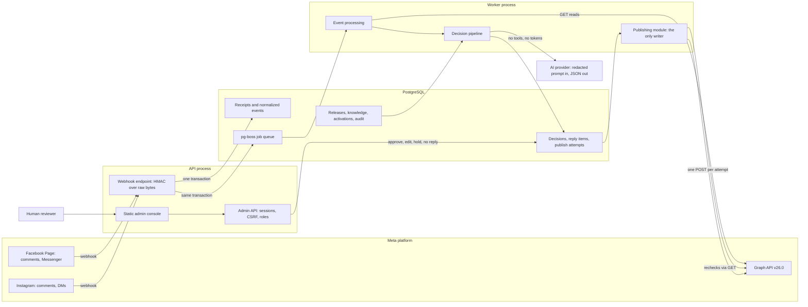

# Architecture diagram

Runtime components and module boundaries. Details: [../docs/architecture.md](../docs/architecture.md).

Enforced boundaries:

- Only `src/publishing/` may import a write transport (ESLint rule).
- AI, pipeline and evaluation code may not import Meta adapters or publishing (ESLint rule).
- The AI provider receives an already-redacted prompt and a JSON schema; it holds no Meta token,
  database access or publishing capability.
