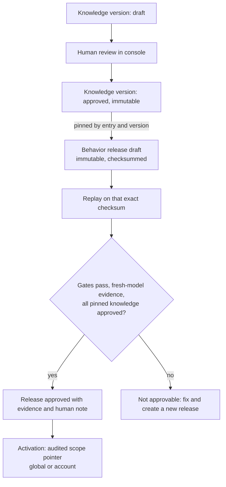
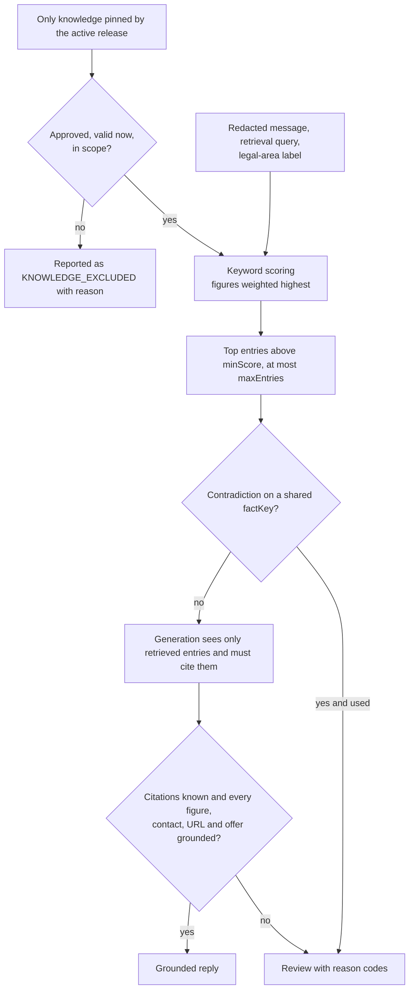

# Knowledge flow

From a draft knowledge entry to a grounded reply. Details:
[../docs/knowledge-system.md](../docs/knowledge-system.md).

## Lifecycle

## At decision time

General legal-area guidance (`general_info`) can be retrieved for context, but it can never on its
own ground a product, price or contact reply.
