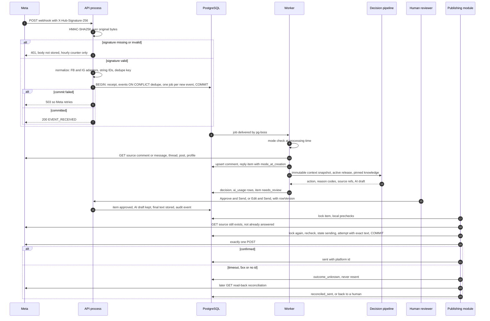

# Message flow

From webhook bytes to one human-approved reply. Details:
[../docs/message-lifecycle.md](../docs/message-lifecycle.md).

```mermaid
sequenceDiagram
    autonumber
    participant M as Meta
    participant A as API process
    participant D as PostgreSQL
    participant W as Worker
    participant P as Decision pipeline
    participant H as Human reviewer
    participant X as Publishing module

    M->>A: POST webhook with X-Hub-Signature-256
    A->>A: HMAC-SHA256 over original bytes
    alt signature missing or invalid
        A-->>M: 401, body not stored, hourly counter only
    else signature valid
        A->>A: normalize: FB and IG adapters, string IDs, dedupe key
        A->>D: BEGIN: receipt, events ON CONFLICT dedupe, one job per new event, COMMIT
        alt commit failed
            A-->>M: 503 so Meta retries
        else committed
            A-->>M: 200 EVENT_RECEIVED
        end
    end

    D->>W: job delivered by pg-boss
    W->>W: mode check at processing time
    W->>M: GET source comment or message, thread, post, profile
    W->>D: upsert comment, reply item with mode_at_creation
    W->>P: immutable context snapshot, active release, pinned knowledge
    P-->>W: action, reason codes, source refs, AI draft
    W->>D: decision, ai_usage rows, item needs_review

    H->>A: Approve and Send, or Edit and Send, with rowVersion
    A->>D: item approved, AI draft kept, final text stored, audit event

    X->>D: lock item, local prechecks
    X->>M: GET source still exists, not already answered
    X->>D: lock again, recheck, state sending, attempt with exact text, COMMIT
    X->>M: exactly one POST
    alt confirmed
        X->>D: sent with platform id
    else timeout, 5xx or no id
        X->>D: outcome_unknown, never resent
        X->>M: later GET read-back reconciliation
        X->>D: reconciled_sent, or back to a human
    end
```
