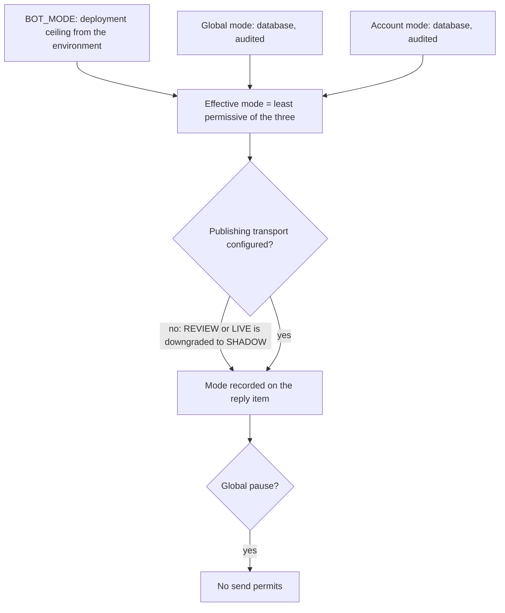
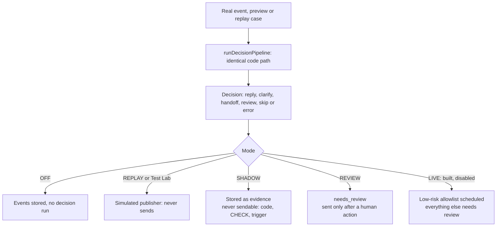

# Mode flow

One pipeline for every mode; modes differ only at dispatch eligibility. Details:
[../docs/safety-and-review.md](../docs/safety-and-review.md).

## Effective mode

## Same pipeline, different dispatch

On 1 October 2026 production runs REVIEW with `LIVE_AUTOSEND_ENABLED=false`. LIVE is refused
unless `BOT_MODE=LIVE`.
