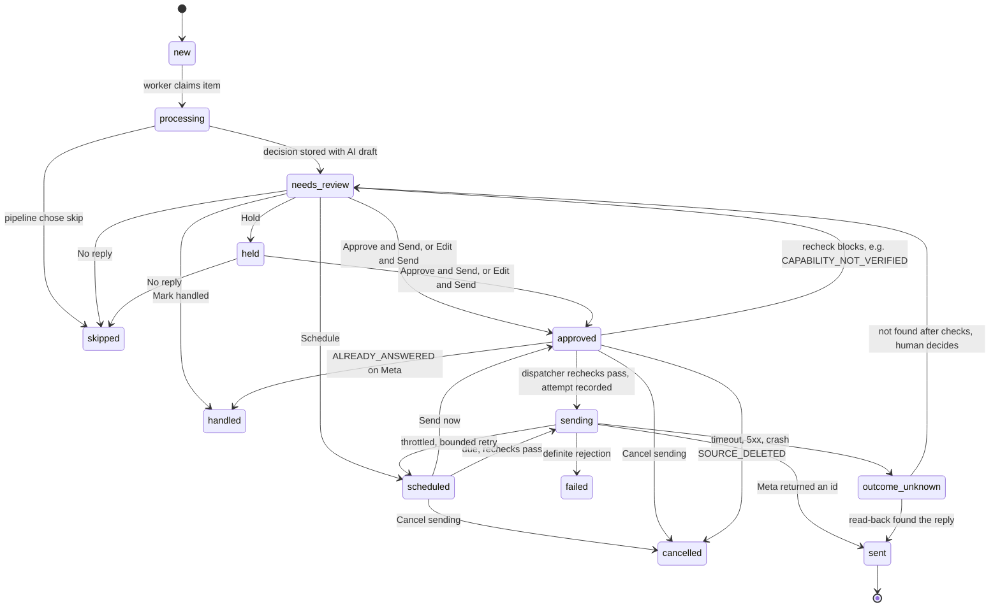

# Review flow

Reply item states and the human actions that move them. Details:
[../docs/safety-and-review.md](../docs/safety-and-review.md#human-review).

Invariants on this state machine:

- The AI draft is immutable; the human's final text is stored separately.
- Entering `approved`, `scheduled` or `sending` is refused by a database trigger while paused or
  below REVIEW, and is impossible for items created in SHADOW.
- `sent` is final.
- At most one open attempt (`pending` or `outcome_unknown`) per item; `outcome_unknown` is never
  resent automatically.
- Every transition is written to the audit log.
